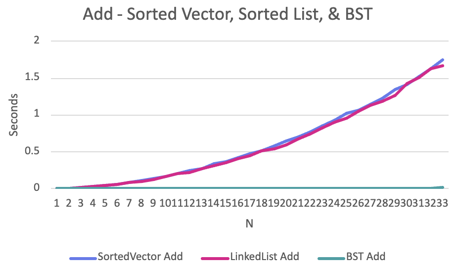

Name: Aliya Salmanova
Semester: Fall 2025
Class: CS 5008

# Report for Data Structure Speed Comparison Homework

Make sure to answer every question in this homework. You should not bullet point your answers, but
instead write them as a full report format. This doesn't mean you have to be wordy, as concise is good,
but it does mean you need to use proper grammar, spelling, and be complete. For question that just
ask for a short answer, answer accordingly. Make sure to include references where appropriate.

## Algorithmic Analysis - Big $O$

Complete the Big O table below for the following functions. You may use any resource you like, but
for the SortedVector and SortedList, you should use the Big O for the functions you wrote in the
the homework. Both Single and Double Linked List you can assume head and tail pointers are available. 
Don't forget to use latex math notation (example in the table).

### Big $O$ Table

| -                         | Add/Insert |   Remove   | Search/Find |     Sort     | Add Front |    Add Back     | Remove Front | Remove Back | Get by Index |
| ------------------------- |:----------:|:----------:|:-----------:|:------------:|:---------:|:---------------:|:------------:|:-----------:|:------------:|
| Vector                    |   $O(n)$   |   $O(n)$   |   $O(n)$    | $O(n log n)$ |  $O(n)$   | $O(1)amortized$ |    $O(n)$    |   $O(1)$    |    $O(1)$    |
| Single Linked List        |   $O(n)$   |   $O(n)$   |   $O(n)$    | $O(n log n)$ |  $O(1)$   |     $O(1)$      |    $O(1)$    |   $O(n)$    |    $O(n)$    |
| Double Linked List        |   $O(n)$   |   $O(n)$   |   $O(n)$    | $O(n log n)$ |  $O(1)$   |     $O(1)$      |    $O(1)$    |   $O(1)$    |    $O(n)$    |
| Sorted Vector             |  $O(n) $   |   $O(n)$   | $O(log n)$  |    $O(1)$    |    ---    |       ---       |     ---      |     ---     |     ---      |
| Sorted Single Linked List |   $O(n)$   |   $O(n)$   |   $O(n)$    |    $O(1)$    |    ---    |       ---       |     ---      |     ---     |     ---      |
| Sorted Double Linked List |   $O(n)$   |   $O(n)$   |   $O(n)$    |    $O(1)$    |    ---    |       ---       |     ---      |     ---     |     ---      |
| Binary Search Tree        | $O(log n)$ | $O(log n)$ | $O(log n)$  |    $O(n)$    |    ---    |       ---       |     ---      |     ---     |     ---      |

For Sort, we are asking for the Big $O$ for taking the current data structure and writing it 'sorted' to a file. However, not the file writes. For example, if you have a vector of 1000 elements, and you want to write it to a file, you would need to sort it first. So, the Big $O$ for this would be the Big $O$ for sorting. For BST, you have to convert the tree to a sequential structure, so the cost of doing that.  

### Assumptions with Sort

Since the worst case can change considerably based on what sort you use for sorting (if any), list each algorithm below, and specify the algorithm used in your assumption.  For BST, write which method of traversal you would use to sort it.  

* Vector - merge sort 
* Single Linked List - merge sort
* Double Linked List - merge sort
* Sorted Vector - already sorted
* Sorted Single Linked List - already sorted
* Sorted Double Linked List - already sorted
* Binary Search Tree - in-order traversal

### Worst Case vs. Average Case

There are a few functions whose worse case is very different than the average case. Name at least two of them, and explain why the worse case is so much worse than the average case. 

1. Binary search tree operations. The average case is O(log n) for a balanced tree. 
But the worst case would be an unbalanced tree, as then finding a certain node would be O(n),
as you'd just go down one side.
2. Adding to a vector. Best case is O(n). But in worst case, you'd have to do amortized resizing of the array.
Worst case happens when you've maxed out the capacity of the vector, and need to create a vector of a larger size,
initializing a new vector and copying over all previous values.

## Empirical Analysis - Speed Comparison

For this section, you will need to have run the speed compare program and generated the output into a CSV file.

### Empirical Results Table

Add a link from this document to the CSV file you generated. The CSV file must have at least 15 different N values, but
often can have a lot more depending on what you ran.  

[CSV file](/results_100k.csv)

| N            | SortedVector Add | LinkedList Add | BST Add  | SortedVector Search | LinkedList Search | BST Search | SortedVector Save | SortedList Save | BST Save | SortedVector Remove | SortedList Remove | BST Remove | Vector Add Front | LinkedList Add Front | Vector Add Back | LinkedList Add Back | Vector Remove Front | LinkedList Remove Front | Vector Remove Back | LinkedList Remove Back | Vector Get | LinkedList Get |
|--------------|------------------|----------------|----------|---------------------|-------------------|------------|-------------------|-----------------|----------|---------------------|-------------------|------------|------------------|----------------------|-----------------|---------------------|---------------------|-------------------------|--------------------|------------------------|------------|----------------|
| 1000.000000  | 0.003332         | 0.002531       | 0.000312 | 0.000369            | 0.002502          | 0.000428   | 0.000154          | 0.000116        | 0.000134 | 0.000611            | 0.001751          | 0.000509   | 0.000689         | 0.000014             | 0.000007        | 0.000015            | 0.000741            | 0.000005                | 0.000005           | 0.000779               | 0.000003   | 0.000525       |
| 2000.000000  | 0.009894         | 0.007585       | 0.000536 | 0.000627            | 0.007267          | 0.000538   | 0.000193          | 0.000167        | 0.000192 | 0.001443            | 0.004892          | 0.000794   | 0.002015         | 0.000017             | 0.000010        | 0.000025            | 0.002154            | 0.000007                | 0.000009           | 0.002337               | 0.000005   | 0.001630       |
| 3000.000000  | 0.016140         | 0.013696       | 0.000659 | 0.000816            | 0.015010          | 0.000709   | 0.000222          | 0.000222        | 0.000247 | 0.002505            | 0.010670          | 0.001129   | 0.003904         | 0.000028             | 0.000017        | 0.000029            | 0.004334            | 0.000009                | 0.000010           | 0.004616               | 0.000006   | 0.003209       |
| 4000.000000  | 0.026854         | 0.024479       | 0.000905 | 0.001013            | 0.031713          | 0.000998   | 0.000292          | 0.000289        | 0.000320 | 0.003964            | 0.023772          | 0.001711   | 0.006935         | 0.000046             | 0.000018        | 0.000031            | 0.007688            | 0.000014                | 0.000014           | 0.008321               | 0.000009   | 0.005421       |
| 5000.000000  | 0.042848         | 0.037668       | 0.001172 | 0.001371            | 0.049262          | 0.001337   | 0.000377          | 0.000357        | 0.000412 | 0.005985            | 0.039065          | 0.002121   | 0.010994         | 0.000047             | 0.000031        | 0.000044            | 0.012165            | 0.000030                | 0.000022           | 0.013312               | 0.000011   | 0.010935       |
| 6000.000000  | 0.061573         | 0.057037       | 0.001492 | 0.001840            | 0.076804          | 0.001700   | 0.000418          | 0.000404        | 0.000491 | 0.008433            | 0.058569          | 0.002555   | 0.015693         | 0.000060             | 0.000033        | 0.000059            | 0.017218            | 0.000023                | 0.000021           | 0.018606               | 0.000013   | 0.016913       |
| 7000.000000  | 0.082978         | 0.078082       | 0.001782 | 0.002217            | 0.107183          | 0.002073   | 0.000494          | 0.000492        | 0.000543 | 0.011125            | 0.081433          | 0.003227   | 0.021966         | 0.000067             | 0.000035        | 0.000063            | 0.023789            | 0.000028                | 0.000025           | 0.025533               | 0.000015   | 0.024571       |
| 8000.000000  | 0.106226         | 0.098564       | 0.002087 | 0.002344            | 0.146765          | 0.002365   | 0.000558          | 0.000600        | 0.000693 | 0.014441            | 0.112426          | 0.003743   | 0.031844         | 0.000093             | 0.000056        | 0.000067            | 0.035195            | 0.000030                | 0.000029           | 0.033559               | 0.000023   | 0.034430       |
| 9000.000000  | 0.138429         | 0.128470       | 0.002398 | 0.002628            | 0.195099          | 0.002738   | 0.000644          | 0.000639        | 0.000697 | 0.018499            | 0.161714          | 0.004281   | 0.035938         | 0.000129             | 0.000067        | 0.000074            | 0.040097            | 0.000052                | 0.000042           | 0.043305               | 0.000023   | 0.039026       |
| 10000.000000 | 0.167514         | 0.166524       | 0.002625 | 0.003100            | 0.246072          | 0.003156   | 0.000684          | 0.000703        | 0.000750 | 0.021998            | 0.193333          | 0.004895   | 0.043802         | 0.000104             | 0.000065        | 0.000078            | 0.048444            | 0.000054                | 0.000035           | 0.056588               | 0.000030   | 0.060111       |
| 11000.000000 | 0.201588         | 0.205498       | 0.002949 | 0.003279            | 0.320630          | 0.003760   | 0.000791          | 0.000741        | 0.000899 | 0.026761            | 0.246700          | 0.005906   | 0.054092         | 0.000093             | 0.000073        | 0.000095            | 0.060428            | 0.000047                | 0.000045           | 0.068408               | 0.000024   | 0.044720       |
| 12000.000000 | 0.246055         | 0.221566       | 0.003282 | 0.004201            | 0.343571          | 0.004080   | 0.000801          | 0.000804        | 0.000920 | 0.031361            | 0.273160          | 0.006856   | 0.063335         | 0.000134             | 0.000065        | 0.000101            | 0.071063            | 0.000042                | 0.000042           | 0.074714               | 0.000031   | 0.075064       |
| 13000.000000 | 0.278360         | 0.275816       | 0.004005 | 0.004581            | 0.470259          | 0.004941   | 0.000884          | 0.000861        | 0.000966 | 0.037204            | 0.371636          | 0.007817   | 0.077793         | 0.000212             | 0.000075        | 0.000098            | 0.084586            | 0.000140                | 0.000045           | 0.091731               | 0.000032   | 0.169949       |
| 14000.000000 | 0.334882         | 0.313489       | 0.004062 | 0.004859            | 0.543376          | 0.005459   | 0.001014          | 0.000965        | 0.001100 | 0.043938            | 0.420010          | 0.008847   | 0.087381         | 0.000170             | 0.000080        | 0.000116            | 0.096970            | 0.000123                | 0.000062           | 0.112088               | 0.000032   | 0.104756       |
| 15000.000000 | 0.369871         | 0.347208       | 0.004276 | 0.004686            | 0.589871          | 0.005053   | 0.001119          | 0.001070        | 0.001147 | 0.048961            | 0.468876          | 0.007952   | 0.102897         | 0.000193             | 0.000074        | 0.000158            | 0.112064            | 0.000100                | 0.000056           | 0.178784               | 0.000034   | 0.137467       |
| 16000.000000 | 0.419385         | 0.403516       | 0.004662 | 0.005127            | 0.688268          | 0.005818   | 0.001049          | 0.001064        | 0.001194 | 0.054492            | 0.548647          | 0.009229   | 0.117614         | 0.000147             | 0.000077        | 0.000125            | 0.125441            | 0.000059                | 0.000060           | 0.132765               | 0.000039   | 0.107174       |
| 17000.000000 | 0.473332         | 0.444063       | 0.005009 | 0.005251            | 0.753517          | 0.005639   | 0.001095          | 0.001080        | 0.001255 | 0.061835            | 0.610455          | 0.008726   | 0.130246         | 0.000228             | 0.000096        | 0.000163            | 0.146980            | 0.000075                | 0.000076           | 0.157842               | 0.000039   | 0.227613       |
| 18000.000000 | 0.521158         | 0.507892       | 0.005267 | 0.005920            | 0.901423          | 0.006307   | 0.001146          | 0.001143        | 0.001300 | 0.069240            | 0.726850          | 0.010529   | 0.149718         | 0.000308             | 0.000087        | 0.000167            | 0.164721            | 0.000074                | 0.000067           | 0.179921               | 0.000044   | 0.159371       |
| 19000.000000 | 0.585393         | 0.546812       | 0.005516 | 0.005921            | 0.928488          | 0.006411   | 0.001226          | 0.001195        | 0.001377 | 0.081141            | 0.752706          | 0.010611   | 0.165564         | 0.000300             | 0.000124        | 0.000163            | 0.183185            | 0.000123                | 0.000085           | 0.191141               | 0.000047   | 0.312928       |
| 20000.000000 | 0.647920         | 0.593971       | 0.006054 | 0.006552            | 1.041081          | 0.006773   | 0.001312          | 0.001345        | 0.001436 | 0.090194            | 0.847943          | 0.010799   | 0.187964         | 0.000187             | 0.000124        | 0.000244            | 0.203563            | 0.000074                | 0.000074           | 0.404289               | 0.000062   | 0.177282       |
| 21000.000000 | 0.696247         | 0.682042       | 0.007040 | 0.007837            | 1.195102          | 0.007424   | 0.001331          | 0.001323        | 0.001524 | 0.096401            | 0.960467          | 0.011215   | 0.204582         | 0.000334             | 0.000104        | 0.000198            | 0.226182            | 0.000105                | 0.000078           | 0.241403               | 0.000056   | 0.254508       |
| 22000.000000 | 0.773738         | 0.742229       | 0.006649 | 0.007010            | 1.261770          | 0.008013   | 0.001455          | 0.001394        | 0.001618 | 0.105679            | 1.015666          | 0.012955   | 0.226127         | 0.000362             | 0.000094        | 0.000198            | 0.246596            | 0.000126                | 0.000083           | 0.296720               | 0.000057   | 0.355388       |
| 23000.000000 | 0.844695         | 0.819305       | 0.007087 | 0.007366            | 1.468980          | 0.008060   | 0.001509          | 0.001457        | 0.001749 | 0.118268            | 1.171888          | 0.012676   | 0.248950         | 0.000282             | 0.000117        | 0.000195            | 0.271161            | 0.000229                | 0.000087           | 0.275741               | 0.000059   | 0.315595       |
| 24000.000000 | 0.930176         | 0.897824       | 0.007209 | 0.007669            | 1.565718          | 0.009631   | 0.001596          | 0.001794        | 0.001999 | 0.125590            | 1.269045          | 0.014448   | 0.270280         | 0.000281             | 0.000122        | 0.000207            | 0.296214            | 0.000149                | 0.000091           | 0.311728               | 0.000067   | 0.295688       |
| 25000.000000 | 1.018638         | 0.959831       | 0.007516 | 0.008987            | 1.818130          | 0.010002   | 0.001574          | 0.001572        | 0.001860 | 0.137002            | 1.472403          | 0.014791   | 0.294199         | 0.000373             | 0.000160        | 0.000334            | 0.320818            | 0.000164                | 0.000093           | 0.331405               | 0.000068   | 0.426865       |
| 26000.000000 | 1.072021         | 1.053901       | 0.007916 | 0.008350            | 1.867644          | 0.009506   | 0.001665          | 0.001710        | 0.001884 | 0.148694            | 1.487294          | 0.014535   | 0.320123         | 0.000353             | 0.000156        | 0.000286            | 0.349353            | 0.000113                | 0.000096           | 0.360464               | 0.000069   | 0.371030       |
| 27000.000000 | 1.140779         | 1.136831       | 0.008654 | 0.008703            | 1.993004          | 0.010181   | 0.001787          | 0.001965        | 0.002025 | 0.161374            | 1.601796          | 0.015801   | 0.348111         | 0.000278             | 0.000123        | 0.000369            | 0.376298            | 0.000137                | 0.000110           | 0.668670               | 0.000081   | 0.322815       |
| 28000.000000 | 1.225397         | 1.190061       | 0.008719 | 0.009144            | 2.064426          | 0.010295   | 0.001764          | 0.001769        | 0.002165 | 0.172248            | 1.696978          | 0.018387   | 0.370047         | 0.000495             | 0.000127        | 0.000259            | 0.407152            | 0.000175                | 0.000107           | 0.430623               | 0.000087   | 0.430775       |
| 29000.000000 | 1.346886         | 1.273159       | 0.009301 | 0.009542            | 2.097982          | 0.011638   | 0.001837          | 0.001877        | 0.002268 | 0.185972            | 1.743461          | 0.016958   | 0.396553         | 0.000305             | 0.000140        | 0.000429            | 0.433274            | 0.000261                | 0.000123           | 0.461363               | 0.000084   | 0.500656       |
| 30000.000000 | 1.408609         | 1.424207       | 0.009336 | 0.009935            | 2.533809          | 0.010903   | 0.001944          | 0.001929        | 0.002206 | 0.199589            | 2.028994          | 0.019589   | 0.425702         | 0.000499             | 0.000132        | 0.000246            | 0.467983            | 0.000241                | 0.000115           | 0.470110               | 0.000089   | 0.565937       |
| 31000.000000 | 1.522528         | 1.502731       | 0.010225 | 0.011376            | 2.532546          | 0.011280   | 0.002117          | 0.002126        | 0.002412 | 0.212869            | 2.064452          | 0.018911   | 0.459176         | 0.000393             | 0.000134        | 0.000291            | 0.503144            | 0.000205                | 0.000116           | 0.537191               | 0.000092   | 0.498806       |
| 32000.000000 | 1.630161         | 1.634626       | 0.010616 | 0.010585            | 3.140786          | 0.012762   | 0.002073          | 0.002214        | 0.002539 | 0.230431            | 2.551226          | 0.020853   | 0.489557         | 0.000351             | 0.000142        | 0.000229            | 0.535283            | 0.000206                | 0.000111           | 0.588204               | 0.000133   | 0.518249       |
| 33000.000000 | 1.749298         | 1.667395       | 0.011452 | 0.011927            | 3.102686          | 0.014374   | 0.002384          | 0.002263        | 0.002505 | 0.251568            | 2.503034          | 0.023691   | 0.525089         | 0.000526             | 0.000139        | 0.000322            | 0.574940            | 0.000430                | 0.000130           | 0.616487               | 0.000102   | 1.080989       |
| 34000.000000 | 1.845243         | 1.785680       | 0.011753 | 0.011496            | 3.331519          | 0.014545   | 0.002466          | 0.002430        | 0.002833 | 0.265470            | 2.718486          | 0.021938   | 0.554873         | 0.000294             | 0.000170        | 0.000353            | 0.615895            | 0.000120                | 0.000132           | 1.467349               | 0.000104   | 0.459232       |
| 35000.000000 | 2.022590         | 1.974801       | 0.012252 | 0.013477            | 3.737248          | 0.015148   | 0.002776          | 0.002518        | 0.002984 | 0.289180            | 2.994648          | 0.022938   | 0.589825         | 0.000350             | 0.000191        | 0.000499            | 0.651979            | 0.000172                | 0.000130           | 0.816328               | 0.000111   | 0.537038       |
| 36000.000000 | 2.050958         | 2.084862       | 0.012640 | 0.013036            | 3.954600          | 0.015737   | 0.002513          | 0.002566        | 0.002908 | 0.309445            | 3.160598          | 0.023617   | 0.621332         | 0.000401             | 0.000194        | 0.000368            | 0.679727            | 0.000171                | 0.000135           | 1.257384               | 0.000120   | 0.533738       |
| 37000.000000 | 2.232197         | 2.076820       | 0.013709 | 0.013842            | 3.609597          | 0.015502   | 0.002563          | 0.002520        | 0.002868 | 0.319484            | 3.010005          | 0.025655   | 0.658594         | 0.000375             | 0.000160        | 0.000581            | 0.725587            | 0.000215                | 0.000169           | 1.689565               | 0.000114   | 0.887225       |
| 38000.000000 | 2.291123         | 2.280277       | 0.013241 | 0.013526            | 4.269949          | 0.016171   | 0.002675          | 0.002658        | 0.003089 | 0.323190            | 3.434444          | 0.025802   | 0.690374         | 0.000382             | 0.000187        | 0.000340            | 0.757727            | 0.000220                | 0.000142           | 0.817558               | 0.000129   | 0.713495       |
| 39000.000000 | 2.415734         | 2.365550       | 0.013805 | 0.014761            | 4.382696          | 0.016756   | 0.002685          | 0.002746        | 0.003061 | 0.339438            | 3.536978          | 0.025328   | 0.740158         | 0.000689             | 0.000182        | 0.000375            | 0.806027            | 0.000372                | 0.000146           | 0.932397               | 0.000120   | 1.777441       |
| 40000.000000 | 2.577724         | 2.700052       | 0.014376 | 0.014143            | 4.880182          | 0.018311   | 0.002784          | 0.003354        | 0.003220 | 0.360836            | 3.903996          | 0.027245   | 0.769213         | 0.000500             | 0.000188        | 0.000510            | 0.841066            | 0.000188                | 0.000149           | 0.906454               | 0.000125   | 0.697244       |
| 41000.000000 | 2.660198         | 2.835005       | 0.014806 | 0.014749            | 5.491635          | 0.017845   | 0.002807          | 0.002982        | 0.003256 | 0.376128            | 4.273875          | 0.027546   | 0.804997         | 0.000383             | 0.000195        | 0.000393            | 0.877067            | 0.000251                | 0.000153           | 0.947987               | 0.000131   | 0.675044       |
| 42000.000000 | 2.777884         | 2.760995       | 0.014851 | 0.014732            | 5.042421          | 0.018061   | 0.002917          | 0.002880        | 0.003337 | 0.395871            | 4.101935          | 0.028934   | 0.843937         | 0.000581             | 0.000253        | 0.000507            | 0.921459            | 0.000526                | 0.000157           | 1.923652               | 0.000135   | 1.850072       |
| 43000.000000 | 2.938762         | 2.884977       | 0.015563 | 0.015697            | 5.200293          | 0.018060   | 0.002894          | 0.003087        | 0.003379 | 0.415364            | 4.210453          | 0.028798   | 0.885375         | 0.000469             | 0.000249        | 0.000385            | 0.967584            | 0.000323                | 0.000161           | 1.026248               | 0.000147   | 0.907389       |
| 44000.000000 | 3.027225         | 3.319845       | 0.016018 | 0.015945            | 6.578323          | 0.019708   | 0.003034          | 0.003467        | 0.003484 | 0.432796            | 5.175754          | 0.029581   | 0.925495         | 0.000635             | 0.000195        | 0.000469            | 1.012474            | 0.000322                | 0.000164           | 1.064304               | 0.000144   | 0.832436       |
| 45000.000000 | 3.278277         | 3.219811       | 0.016362 | 0.016281            | 6.107035          | 0.019186   | 0.003074          | 0.003217        | 0.003514 | 0.461219            | 4.891685          | 0.030291   | 0.975844         | 0.000670             | 0.000187        | 0.000510            | 1.061421            | 0.000260                | 0.000157           | 2.304790               | 0.000153   | 1.882077       |
| 46000.000000 | 3.372851         | 3.450204       | 0.017784 | 0.017435            | 6.454648          | 0.019872   | 0.003105          | 0.003635        | 0.003649 | 0.477988            | 5.214312          | 0.030804   | 1.018238         | 0.000540             | 0.000210        | 0.000569            | 1.158820            | 0.000256                | 0.000186           | 1.302480               | 0.000160   | 0.950981       |
| 47000.000000 | 3.474108         | 3.647776       | 0.016130 | 0.016178            | 7.118432          | 0.020432   | 0.003115          | 0.003307        | 0.003586 | 0.488884            | 5.658012          | 0.032938   | 1.060734         | 0.000427             | 0.000222        | 0.000376            | 1.123475            | 0.000197                | 0.000164           | 1.202574               | 0.000174   | 0.895062       |
| 48000.000000 | 3.517679         | 3.501003       | 0.016743 | 0.016648            | 7.239425          | 0.022158   | 0.003035          | 0.003997        | 0.003622 | 0.576940            | 5.821419          | 0.031309   | 1.090435         | 0.000851             | 0.000220        | 0.000370            | 1.205012            | 0.000603                | 0.000167           | 1.259403               | 0.000152   | 2.477968       |
| 49000.000000 | 3.773383         | 3.783391       | 0.019601 | 0.021392            | 7.181043          | 0.020263   | 0.003099          | 0.003144        | 0.003578 | 0.543940            | 5.699219          | 0.037043   | 1.143851         | 0.000689             | 0.000226        | 0.000494            | 1.255914            | 0.000492                | 0.000169           | 1.371783               | 0.000164   | 1.831361       |
| 50000.000000 | 3.909452         | 3.844863       | 0.019248 | 0.018305            | 7.149867          | 0.020660   | 0.003261          | 0.003536        | 0.003932 | 0.579300            | 5.792277          | 0.036296   | 1.194005         | 0.000658             | 0.000250        | 0.000438            | 1.306852            | 0.000362                | 0.000216           | 1.322162               | 0.000170   | 1.515345       |
| 51000.000000 | 4.089181         | 4.338457       | 0.019083 | 0.019128            | 8.795668          | 0.021421   | 0.003426          | 0.004249        | 0.004010 | 0.590068            | 6.891636          | 0.033473   | 1.446739         | 0.000451             | 0.000243        | 0.000458            | 1.578992            | 0.000227                | 0.000225           | 1.417999               | 0.000184   | 1.189264       |
| 52000.000000 | 4.261368         | 4.408881       | 0.018584 | 0.018255            | 9.854434          | 0.022447   | 0.003626          | 0.003717        | 0.003863 | 0.621390            | 7.574218          | 0.041551   | 1.297966         | 0.000852             | 0.000254        | 0.000430            | 1.419345            | 0.000680                | 0.000205           | 1.470804               | 0.000175   | 2.615062       |
| 53000.000000 | 4.430762         | 4.473566       | 0.019955 | 0.019460            | 8.203687          | 0.023161   | 0.003642          | 0.004283        | 0.004106 | 0.643291            | 6.767999          | 0.043030   | 1.370665         | 0.001075             | 0.000256        | 0.000636            | 1.483111            | 0.000807                | 0.000202           | 2.465929               | 0.000190   | 3.377615       |
| 54000.000000 | 4.579260         | 4.710451       | 0.020283 | 0.019753            | 9.108409          | 0.024007   | 0.003632          | 0.003719        | 0.004339 | 0.678312            | 7.325015          | 0.036942   | 1.400960         | 0.000524             | 0.000288        | 0.000676            | 1.595064            | 0.000270                | 0.000217           | 3.313429               | 0.000195   | 1.323449       |
| 55000.000000 | 4.718250         | 4.893315       | 0.020888 | 0.020548            | 9.657984          | 0.024591   | 0.003654          | 0.004660        | 0.004178 | 0.698800            | 7.950039          | 0.038031   | 1.458708         | 0.000614             | 0.000264        | 0.000953            | 1.596606            | 0.000295                | 0.000205           | 2.466763               | 0.000182   | 1.585706       |
| 56000.000000 | 4.994513         | 5.117393       | 0.021450 | 0.021050            | 10.097728         | 0.024765   | 0.003828          | 0.004133        | 0.004591 | 0.722902            | 8.244892          | 0.038497   | 1.515957         | 0.000597             | 0.000279        | 0.000699            | 1.655149            | 0.000198                | 0.000208           | 1.788303               | 0.000195   | 1.498591       |
| 57000.000000 | 5.065473         | 5.636608       | 0.022026 | 0.021453            | 11.529456         | 0.025398   | 0.003857          | 0.004440        | 0.004682 | 0.758434            | 9.128076          | 0.039162   | 1.812362         | 0.000559             | 0.000345        | 0.000747            | 1.966799            | 0.000336                | 0.000212           | 4.335010               | 0.000183   | 1.501256       |
| 58000.000000 | 5.180759         | 5.346423       | 0.022152 | 0.021603            | 11.157469         | 0.025950   | 0.003909          | 0.005090        | 0.004595 | 0.766553            | 9.362887          | 0.045131   | 1.616464         | 0.000507             | 0.000279        | 0.000767            | 1.778337            | 0.000201                | 0.000221           | 5.132004               | 0.000181   | 1.329275       |
| 59000.000000 | 5.429570         | 5.562579       | 0.024355 | 0.026103            | 10.956669         | 0.027422   | 0.004054          | 0.004496        | 0.004753 | 0.827510            | 9.157111          | 0.044467   | 1.695112         | 0.000930             | 0.000360        | 0.000591            | 1.831113            | 0.001043                | 0.000220           | 2.015034               | 0.000204   | 3.367866       |
| 60000.000000 | 5.724297         | 6.008088       | 0.023121 | 0.022683            | 12.014590         | 0.026833   | 0.004130          | 0.004151        | 0.004766 | 0.848002            | 9.657647          | 0.042218   | 1.736371         | 0.001324             | 0.000241        | 0.000493            | 1.906868            | 0.000470                | 0.000251           | 2.014216               | 0.000194   | 3.810733       |
| 61000.000000 | 5.766198         | 5.713065       | 0.023790 | 0.024493            | 11.335934         | 0.029616   | 0.004588          | 0.004376        | 0.004905 | 0.885055            | 9.365930          | 0.042210   | 1.796876         | 0.000900             | 0.000294        | 0.000582            | 1.983855            | 0.000562                | 0.000255           | 2.244059               | 0.000194   | 4.641794       |
| 62000.000000 | 5.970327         | 6.226174       | 0.024384 | 0.024626            | 12.796568         | 0.029073   | 0.004451          | 0.005025        | 0.005193 | 0.902611            | 10.411962         | 0.050370   | 1.860394         | 0.000850             | 0.000372        | 0.000636            | 2.025288            | 0.000406                | 0.000230           | 3.132163               | 0.000204   | 3.563554       |
| 63000.000000 | 6.036141         | 6.125211       | 0.024254 | 0.023850            | 12.364869         | 0.028335   | 0.004428          | 0.004651        | 0.004944 | 0.923211            | 10.242556         | 0.043336   | 1.912585         | 0.000951             | 0.000318        | 0.000720            | 2.082682            | 0.000642                | 0.000236           | 3.852800               | 0.000201   | 3.502355       |
| 64000.000000 | 6.251400         | 6.258077       | 0.025219 | 0.024619            | 12.657513         | 0.028694   | 0.004333          | 0.004888        | 0.005275 | 0.956075            | 10.487155         | 0.045799   | 1.968018         | 0.000986             | 0.000352        | 0.000605            | 2.149186            | 0.000842                | 0.000240           | 2.287838               | 0.000207   | 3.230818       |
| 65000.000000 | 6.463878         | 6.877912       | 0.025504 | 0.024825            | 13.649413         | 0.029052   | 0.004558          | 0.005436        | 0.005356 | 0.987575            | 11.334186         | 0.050428   | 2.032965         | 0.000866             | 0.000376        | 0.000854            | 2.244968            | 0.000510                | 0.000241           | 4.831201               | 0.000205   | 2.951088       |
| 66000.000000 | 6.722600         | 7.016645       | 0.025873 | 0.026538            | 14.252102         | 0.029457   | 0.004465          | 0.004587        | 0.005225 | 1.042840            | 11.764248         | 0.046918   | 2.106031         | 0.000812             | 0.000311        | 0.000676            | 2.317354            | 0.000439                | 0.000246           | 4.583521               | 0.000216   | 3.509256       |
| 67000.000000 | 6.993303         | 7.386479       | 0.026829 | 0.026411            | 15.048125         | 0.030564   | 0.004510          | 0.004588        | 0.005363 | 1.044453            | 12.371968         | 0.061129   | 2.181026         | 0.001312             | 0.000281        | 0.000636            | 2.401415            | 0.000441                | 0.000250           | 4.255671               | 0.000248   | 4.154451       |
| 68000.000000 | 7.065714         | 7.716734       | 0.026656 | 0.026157            | 15.796599         | 0.031810   | 0.004664          | 0.005553        | 0.005636 | 1.114419            | 12.970923         | 0.047629   | 2.573700         | 0.001219             | 0.000435        | 0.000798            | 2.842657            | 0.000830                | 0.000293           | 3.554946               | 0.000203   | 5.164054       |
| 69000.000000 | 7.344581         | 7.748062       | 0.027118 | 0.026839            | 15.614650         | 0.031082   | 0.004678          | 0.005201        | 0.005555 | 1.120491            | 12.972443         | 0.048609   | 2.296476         | 0.001308             | 0.000302        | 0.000581            | 2.528203            | 0.000904                | 0.000273           | 2.732062               | 0.000220   | 6.450287       |
| 70000.000000 | 7.628407         | 7.724098       | 0.027565 | 0.028400            | 15.639946         | 0.031908   | 0.004933          | 0.005615        | 0.005736 | 1.202706            | 13.091035         | 0.057915   | 2.379200         | 0.001110             | 0.000299        | 0.000598            | 2.599285            | 0.000709                | 0.000279           | 2.820674               | 0.000205   | 5.855981       |
| 71000.000000 | 7.746409         | 8.121408       | 0.028020 | 0.027217            | 16.197685         | 0.032342   | 0.004820          | 0.005156        | 0.005886 | 1.169450            | 13.461969         | 0.052025   | 2.465777         | 0.000824             | 0.000354        | 0.000615            | 2.663103            | 0.000501                | 0.000276           | 2.870720               | 0.000215   | 5.099911       |
| 72000.000000 | 7.991152         | 8.214165       | 0.029342 | 0.033109            | 17.402046         | 0.032762   | 0.005003          | 0.005557        | 0.005971 | 1.214325            | 14.630907         | 0.060214   | 2.526392         | 0.000635             | 0.000314        | 0.000610            | 2.729244            | 0.000333                | 0.000268           | 2.948275               | 0.000221   | 2.446358       |
| 73000.000000 | 8.030327         | 9.239902       | 0.028997 | 0.028239            | 19.874919         | 0.035497   | 0.005048          | 0.006161        | 0.006518 | 1.257908            | 16.252755         | 0.051902   | 2.596447         | 0.000672             | 0.000307        | 0.000868            | 2.827807            | 0.000288                | 0.000271           | 4.301856               | 0.000222   | 2.433148       |
| 74000.000000 | 8.319434         | 9.372467       | 0.029561 | 0.028596            | 19.119205         | 0.033853   | 0.005149          | 0.005853        | 0.006042 | 1.331348            | 15.651669         | 0.053868   | 2.680156         | 0.000685             | 0.000314        | 0.001020            | 2.949529            | 0.000320                | 0.000276           | 5.487198               | 0.000207   | 2.765310       |
| 75000.000000 | 8.433728         | 8.585867       | 0.032236 | 0.029449            | 16.980815         | 0.033907   | 0.005337          | 0.005272        | 0.006196 | 1.327750            | 14.564673         | 0.053652   | 2.741538         | 0.000675             | 0.000366        | 0.001194            | 2.983115            | 0.000398                | 0.000298           | 7.002315               | 0.000207   | 3.161279       |
| 76000.000000 | 8.947695         | 9.253451       | 0.030652 | 0.029671            | 18.602804         | 0.034728   | 0.005167          | 0.005264        | 0.006133 | 1.349446            | 15.790002         | 0.054885   | 3.258290         | 0.000797             | 0.000338        | 0.000789            | 3.523554            | 0.000406                | 0.000283           | 6.735084               | 0.000243   | 3.816548       |
| 77000.000000 | 9.121685         | 9.419639       | 0.033638 | 0.031286            | 18.549922         | 0.035492   | 0.005226          | 0.005763        | 0.006311 | 1.380098            | 15.908276         | 0.055848   | 2.869749         | 0.001076             | 0.000302        | 0.000684            | 3.129925            | 0.000980                | 0.000368           | 3.353256               | 0.000212   | 7.805118       |
| 78000.000000 | 9.412462         | 9.691143       | 0.034729 | 0.035744            | 19.825030         | 0.038068   | 0.005424          | 0.005621        | 0.006341 | 1.446455            | 16.618931         | 0.056553   | 2.942443         | 0.001122             | 0.000459        | 0.000680            | 3.205351            | 0.001001                | 0.000303           | 3.446892               | 0.000215   | 6.101492       |
| 79000.000000 | 9.408009         | 10.435473      | 0.031804 | 0.030921            | 21.004828         | 0.040083   | 0.005637          | 0.005993        | 0.006355 | 1.497913            | 17.529077         | 0.070259   | 3.535841         | 0.000725             | 0.000371        | 0.000913            | 3.825189            | 0.000283                | 0.000293           | 6.085007               | 0.000213   | 2.825037       |
| 80000.000000 | 10.133862        | 9.827683       | 0.034048 | 0.032402            | 18.702067         | 0.038987   | 0.006087          | 0.005852        | 0.006683 | 1.573923            | 15.949913         | 0.069103   | 3.133829         | 0.000697             | 0.000366        | 0.001130            | 3.419491            | 0.000359                | 0.000312           | 7.694491               | 0.000236   | 3.748866       |
| 81000.000000 | 10.098187        | 10.948056      | 0.033629 | 0.033107            | 21.550425         | 0.038247   | 0.005362          | 0.006896        | 0.007465 | 1.601104            | 18.331843         | 0.064928   | 3.172173         | 0.000830             | 0.000427        | 0.000787            | 3.467963            | 0.000381                | 0.000307           | 7.233786               | 0.000197   | 5.000269       |
| 82000.000000 | 10.515626        | 11.047589      | 0.033091 | 0.034290            | 21.898115         | 0.039126   | 0.005565          | 0.006016        | 0.006766 | 1.579477            | 18.035548         | 0.060560   | 3.230877         | 0.001651             | 0.000328        | 0.000853            | 3.525461            | 0.000864                | 0.000292           | 3.569391               | 0.000232   | 7.507671       |
| 83000.000000 | 10.462380        | 11.453103      | 0.034145 | 0.034200            | 22.155162         | 0.041394   | 0.005824          | 0.007622        | 0.007087 | 1.618688            | 18.678021         | 0.060386   | 3.320347         | 0.000737             | 0.000363        | 0.001419            | 3.615220            | 0.000310                | 0.000347           | 7.135332               | 0.000228   | 3.101873       |
| 84000.000000 | 10.733055        | 10.739784      | 0.033938 | 0.032970            | 19.800473         | 0.038710   | 0.005964          | 0.006318        | 0.006834 | 1.661987            | 17.155673         | 0.061692   | 3.401577         | 0.000860             | 0.000442        | 0.001282            | 3.740241            | 0.000424                | 0.000314           | 9.178483               | 0.000219   | 4.427353       |
| 85000.000000 | 11.155929        | 12.207044      | 0.034503 | 0.033131            | 23.782387         | 0.038545   | 0.005785          | 0.006039        | 0.006729 | 1.737633            | 19.992219         | 0.078291   | 3.507779         | 0.000962             | 0.000447        | 0.000800            | 3.878499            | 0.000524                | 0.000349           | 4.223213               | 0.000264   | 8.401223       |
| 86000.000000 | 11.259807        | 12.125807      | 0.035119 | 0.033979            | 24.472705         | 0.038968   | 0.006887          | 0.006506        | 0.006890 | 1.750996            | 20.709355         | 0.061661   | 3.555628         | 0.000786             | 0.000440        | 0.001544            | 3.881138            | 0.000271                | 0.000321           | 7.408092               | 0.000237   | 3.370692       |
| 87000.000000 | 11.489284        | 13.041872      | 0.035376 | 0.034134            | 25.259522         | 0.040300   | 0.006054          | 0.007687        | 0.007131 | 1.797022            | 21.132544         | 0.066710   | 3.670516         | 0.000796             | 0.000364        | 0.001224            | 4.110152            | 0.000388                | 0.000311           | 9.281277               | 0.000220   | 3.850439       |
| 88000.000000 | 12.047304        | 12.613364      | 0.036705 | 0.034757            | 23.658401         | 0.042778   | 0.006001          | 0.006640        | 0.007229 | 1.872622            | 20.391188         | 0.071572   | 3.722883         | 0.001987             | 0.000460        | 0.000863            | 4.117722            | 0.000902                | 0.000359           | 4.807223               | 0.000238   | 10.983056      |
| 89000.000000 | 12.351819        | 13.863448      | 0.036886 | 0.035048            | 27.217647         | 0.041635   | 0.006081          | 0.006377        | 0.007112 | 1.927183            | 22.534716         | 0.065429   | 3.818176         | 0.000847             | 0.000384        | 0.001292            | 4.162574            | 0.000325                | 0.000338           | 8.345837               | 0.000236   | 3.619508       |
| 90000.000000 | 12.327308        | 12.419616      | 0.037009 | 0.035921            | 23.621563         | 0.041438   | 0.006072          | 0.006329        | 0.007710 | 1.953624            | 20.896747         | 0.065094   | 4.523559         | 0.000988             | 0.000384        | 0.001219            | 4.942553            | 0.000693                | 0.000335           | 10.622947              | 0.000246   | 5.492554       |
| 91000.000000 | 12.974425        | 14.136437      | 0.037454 | 0.039148            | 27.807512         | 0.041414   | 0.006094          | 0.006658        | 0.007217 | 2.007139            | 23.762167         | 0.066372   | 4.611483         | 0.001721             | 0.000427        | 0.000814            | 5.076926            | 0.000841                | 0.000347           | 4.699096               | 0.000226   | 9.279422       |
| 92000.000000 | 13.098075        | 14.570061      | 0.037877 | 0.036494            | 28.976479         | 0.044914   | 0.006405          | 0.006827        | 0.008182 | 2.110617            | 24.569585         | 0.067434   | 4.077503         | 0.000956             | 0.000394        | 0.001376            | 4.458769            | 0.000405                | 0.000355           | 10.474035              | 0.000230   | 4.002941       |
| 93000.000000 | 13.321870        | 13.676540      | 0.040245 | 0.038506            | 25.539494         | 0.048646   | 0.006486          | 0.007031        | 0.008507 | 2.129779            | 22.396019         | 0.070344   | 4.237963         | 0.001248             | 0.000390        | 0.000842            | 4.577377            | 0.000756                | 0.000360           | 5.606024               | 0.000229   | 12.352896      |
| 94000.000000 | 13.726261        | 14.986789      | 0.039137 | 0.037328            | 28.925062         | 0.043312   | 0.006480          | 0.007230        | 0.007716 | 2.110133            | 24.125459         | 0.068792   | 4.255001         | 0.000950             | 0.000524        | 0.001556            | 4.657560            | 0.000367                | 0.000335           | 10.345273              | 0.000251   | 4.011411       |
| 95000.000000 | 13.841038        | 14.055633      | 0.039241 | 0.037201            | 26.396353         | 0.043480   | 0.006397          | 0.006773        | 0.007575 | 2.162504            | 23.494036         | 0.076550   | 4.382578         | 0.001323             | 0.000429        | 0.001303            | 4.753379            | 0.001042                | 0.000396           | 7.862763               | 0.000252   | 10.364609      |
| 96000.000000 | 14.233054        | 15.945611      | 0.039753 | 0.039849            | 29.914381         | 0.046522   | 0.006614          | 0.007904        | 0.007779 | 2.216481            | 25.083640         | 0.071697   | 5.128118         | 0.000927             | 0.000419        | 0.001142            | 5.621314            | 0.000478                | 0.000361           | 6.753031               | 0.000248   | 5.420369       |
| 97000.000000 | 14.524464        | 15.566670      | 0.042132 | 0.044193            | 28.644078         | 0.051807   | 0.007173          | 0.006981        | 0.008121 | 2.307680            | 25.264954         | 0.081736   | 4.540825         | 0.001095             | 0.000464        | 0.001391            | 4.963539            | 0.000919                | 0.000360           | 11.742873              | 0.000233   | 7.610105       |
| 98000.000000 | 14.869166        | 16.509290      | 0.042970 | 0.046669            | 32.848126         | 0.049119   | 0.006572          | 0.008623        | 0.008076 | 2.343130            | 27.676892         | 0.089679   | 4.635630         | 0.001036             | 0.000434        | 0.000935            | 5.064351            | 0.000825                | 0.000366           | 5.416360               | 0.000232   | 7.605590       |
| 99000.000000 | 15.527223        | 17.513158      | 0.043398 | 0.040124            | 33.965690         | 0.050461   | 0.006944          | 0.008235        | 0.008961 | 2.402037            | 28.824484         | 0.101505   | 4.813512         | 0.001309             | 0.000444        | 0.001224            | 5.181078            | 0.000603                | 0.000368           | 12.103304              | 0.000239   | 7.822960       |
| 99999.000000 | 15.788882        | 18.230597      | 0.042531 | 0.040374            | 34.880155         | 0.048687   | 0.006774          | 0.007278        | 0.007846 | 2.368835            | 30.441346         | 0.091208   | 5.704409         | 0.000804             | 0.000439        | 0.001421            | 6.146599            | 0.000459                | 0.000385           | 9.157951               | 0.000228   | 6.233944       |
 
### Analysis

Create *at least three* graphics that each visually explain an aspect of your data related to an operation or data structure. Under each one, explain what the graphic is showing, and what you can conclude from it/what you find interesting about it.

> [!IMPORTANT]
> 
> Make sure you are comparing apples to apples and not apples to oranges when choosing what to put in the same graph. 
> 
> **:x: different data structures *and* different operations**
> 
> - Vector Add Front versus BST Add
> 
> **:white_check_mark: different operations *but* same data structure**
> 
> - BST Add versus Remove, and Search for BST
> 
> **:white_check_mark: different data structures *but* same operation**
> 
> - BST Add versus Add for Sorted Vector, and Sorted Single/Double Linked List
> 
> - Vector Add Front versus Add Front for Single/Double Linked List

> [!TIP]
> 
> To create the graphics you can use a third party program like Microsoft Excel or Google Sheets. (Completely optional if you want extra coding: you can use python libraries such as matplotlib, seaborn, or plotly)
> 
> Make sure you can see the image embedded in the Report.md using [image markdown] when you upload it to github, and get help if it doesn't show! 

#### Graphic 1: Single Linked List - Add vs Remove

;

> Insert your comments/observations about the graphic here \
> This graph shows that removing an element from the back of a single linked list
> is O(n), while adding an element to the back is O(1).
> While this makes sense logically after you think through it, it is interesting to me 
> as you would expect both to be O(1). The reason that removing from the back of a single linked list,
> is O(n), even if you have access to the tail, is because you can't simply set the tail to null.
> The correct way to approach this problem is to set the 'next' of the node that comes right before the tail to null,
> and then set the tail to that node that came before the tail (unless your list only consists of 1 node).
> I also was surprised to see such spikes in the graph for removing from the back of a linked list. 

#### Graphic 2: Remove - Sorted Vector, Linked List, & BST

;

> Insert your comments/observations about the graphic here \
> I was surprised to see the Linked List perform so much worst than the other two data structures for removing,
> and I was also surprised that the BST performs that much better.
> While removing a value from both a sorted linked list and sorted vector would be O(n),
> the sorted vector performs much better. For the sorted vector, we could find the value using a binary search, 
> which is O(log n), and then we would have to shift everything that came after to the left, which is O(n).
> With the linked list, we would find the value with O(n) time, and then removing would be O(1) time. 
> My initial thoughts were that the reason it performs so much worse is partly because rotating pointers takes more time than shifting elements in > a vector, and also that the free function could make some difference. Later,
> after I investigated the csv speed_compare_app files, I saw that the tests are set up so that 30% of searches would
> not find the value in the data sets. That means that 30% the time, 
> we would not be able to find the element that we are looking to remove, and for the linked list this would mean 
> traversing the whole list linearly. 
> The BST performs better as it is O(log n) time complexity. I was expecting it to not perform as well as it did though,
> but I suppose O(log n) is more powerful than I thought.
> This observation also shows in the timings of the Linked List Search, Vector Search, and BST Search, 
> as the vector and the bst significantly outperform the linked list, requiring O(log n) time to search,
> while searching a linked list takes O(n) time. 

#### Graphic 3: Add - Sorted Vector, Linked List, & BST

;

> Insert your comments/observations about the graphic here \
> This graph is interesting, as the timings for adding to a sorted vector and linked list are very similar,
> in contrast to removing elements in our previous graph. This is because the vector here has to resize when we reach its full capacity,
> so during certain additions, the vector size would need to increase, using more time. 
> The BST, not surprisingly, outperforms the other two data structures here again with its O(log n) search time. 

## Critical Thought

### Data Evaluation

Answer the questions below. Make sure to answer each question fully, and explain your reasoning. Indent your answers immediately below the question, for it to line up with the bullet point.

For example:

```markdown
1. What is the most surprising result from the data? Why is it surprising?
   Answer here
```

1. What is the most surprising result from the data? Why is it surprising? \
   To me, the most surprising result from the data was that adding to a sorted list has less growth 
   than removing from a sorted list. At first I thought this may be because the free function takes up some time,
   but later realize it is mostly because removing means finding an element, which might not always be there, 
   so often we'd just traverse the whole list linearly without actually decreasing its size. 

2. What data structure is the fast at adding elements (sorted)? Why do you think that is? \
   The BST is by far the fastest, as it would take O(log n) time to add the element.
   The other two data structures add using O(n) time. The linked list takes up O(n) to find where to add the element.
   The sorted vector needs O(log n) time to find where to add the element, O(n) time to shift the following elements,
   and also occasionally (but rarely) needs to resize the vector, which is also O(n) time.

3. What data structure is the fastest at removing elements (sorted)? Why do you think that is? \
   The BST is the fastest at removing elements in a sorted data structure, for the same reason
   it is fastest at adding elements. O(log n) time is normally more efficient than O(n) time. 
   Although your can find the element to remove in the sorted vector with O(log n) time, you would still need to 
   shift down the elements that come after it, taking up O(n) time.

4. What data structure is the fastest at searching? Why do you think that is? \
   The sorted vector is fastest at searching, but BST comes right after it. 
   The sorted vector would take up O(log n) time to search for an element. 
   To just search and not add or remove elements, no shifting would need to take place.
   While the BST also searches with the same time complexity, the vector is faster as the BST requires dealing with 
   pointers to nodes, which I figure takes up a bit more time. 

5. What data structure is the fastest for adding elements to the front? Why do you think that is? \
   The linked list is fastest at adding to the front. This is because it takes O(1) time. 
   The vector would require shifting all the other elements right, and the very occasional resizing of the array. 
   Both these operations take O(n) time. 
   It doesn't make sense to add elements to the front of the BST, so this was not included in the data. 

6. What data structure is the fastest for adding elements to the back? Why do you think that is? \
   The vector is the fastest for adding elements to the back (unless your linked list has a tail). 
   This is because it usually takes O(1) time to add to the back of a vector,
   and occasionally takes O(n) if the vector needs to be resized. 
   So, the time complexity for adding elements to the back of a vector is O(1)amortized. 
   The time complexity of adding to the back of a linked list depends on whether or not you have access to the tail.
   If you don't, you need to traverse the list to reach its tail. If you do, you add a next node to the tail and make the tail
   point to that node. Having access to the tail pointer of the linked list saves a lot of time for adding to the back. 

7. What data structure is the fastest for removing elements from the front? Why do you think that is? \
   The linked list is the fastest for removing elements from the front. This is because it takes O(1) time.
   Removing from the front of the vector takes O(n) time, as you need to shift the rest of the elements down by 1. 
   The list does not require that - it only requires updating the head and freeing the previous head node. 

8. What data structure is the fastest for removing elements from the back? Why do you think that is? \
   The vector is the fastest for removing elements from the back. This is because removing elements from the back of the vector
   is O(1) time, as you already have access to the last element of the vector, and that is all you need. 
   The single linked list takes O(n) time, even when you have access to its tail, as you don't just need to free the tail. 
   You also need access to the previous node before the tail,
   in order to set its next node to null, and then set the tail pointer to that previous node. 
   This changes if you're dealing with a double linked list, as you get easier access to the node that comes before the tail
   by accessing the tail's previous node. 


### Deeper Thinking

#### Double Linked List vs Single Linked List

1. If you wrote your linked list as a single linked list, removing from the back was expensive. If you wrote it as a double linked list, removing from the back was cheap. Why do you think that is? \
   To remove from the back of a linked list, you not only need to free the current tail, but, 
   if there is not only 1 node in the list (in which case you'd set the head and the tail to NULL), 
   you need to update the 'next' pointer of the previous node, and reset the tail to that node that came before the tail.
   This mean you need access to the node that points to the tail. In a double linked list, you can find that node by accessing
   the 'previous' node of the tail, but in a single linked list, you have to traverse the list to find this node, which takes O(n) time.

2. When running most functions, at least ~30% of the tests were worse case scenarios. Why do you think that is? \
   Around 30% of the time, we could not find the element that we were looking for, as 30% of elements (movies) we were searching for did not exist 
   in the data set. 
   This contributed to the remove element performing worse than the add element for linked lists, as removing an element requires finding 
   that particular element first. Since finding an element in a linked list requires traversing the list linearly (O(n) time), 
   the whole list would get traversed when trying to find elements that don't exist in the data set. 

3. What was done in the code to encourage that? \
   In speed_compare_app/tests.h, they define a SAMPLE_SPLIT of .7, which makes 70% of created movies exist in the data structure.
   This means that 30% of the movies aren't put into the data sets, yet we use these movies during searches. 

4. How did this particularly influence the linked list searches? \
   Linked list searches are of O(n) time, so for elements that are not found, we go through/look at every element in the list. 


#### Test Bias

1. The tests were inherently biased towards the BST to perform better due the setup of the experiment. Explain why this is the case.  (hint: think about the randomization of the data, and the worst case scenario for BST). \
   Randomizing the data helps the BST be balanced. It is unlikely for the data to be sorted before adding it to a BST if we are getting these values at random.
   This helps the BST search remain O(log n).


2. What would generate the worst case scenery for a BST? \
   The worst case scenario for searching a BST is if its nodes are already sorted, as it would be unbalanced. This way,
   searching the BST would not be O(log n), but rather would be O(n) time, as we'd have to traverse left linearly,
   or traverse right linearly if it is sorted descending. 

3. Researching beyond the module, how would one fix a BST so the worst case scenario matches (or at least is closer to) the average case.[^1^] \
   There are ways to write 'self-balancing' binary search trees. These self-balancing trees are called AVL trees and Red Black Trees.[^2^]

## Scenario

Fill out the table below. This is a common technical interview topic!

| Structure          | Good to use when                                                                     | Bad to use when                                                                                                  |
| ------------------ |--------------------------------------------------------------------------------------|------------------------------------------------------------------------------------------------------------------|
| Vector             | You need access to random indexes, and you insert mostly to the back of the vector   | You often need to do insertions to the front of the vector or even in the middle                                 |
| Linked List        | Good for stacks with frequent front only access                                      | You need to do a lot of searches and often need access to elements that aren't in the front or beginning of the list |
| Sorted Vector      | When values coming in are already mostly sorted and we need quick search access.     | When space is limited and the dataset is extremely large causing memory to swap.                                 |
| Sorted Linked List | You often need to traverse the data set sequentially anyway and rarely do insertions | You need to do a lot of insertions or a lot of searches for certain values                    |
| BST                | Data is not presorted and you need to remove and add elements often         | data is presorted                                                                                                |

## Conclusion

Summarize your findings. Where there any surprises?  What did you end up learning by comparing speeds?

BST performed quite well for adding and removing movies. The sorted vector did slightly outperform BST for searching.
Sorted linked list searching, adding, and removing are costly, but removing or adding to the front of a linked list is very efficient. 
Vectors are inefficient for adding or removing from the beginning, but efficient for adding to the end, as that doesn't require any shifts, 
it just requires resizing in a few cases.
Adding to a sorted vector was similar to adding to a linked list in performance, as the occasional resizing of the vector and 
the O(n) shift result in it being only as sufficient in time as the linrst time that adding to a linked list requires. 
However, removing from a sorted vector was more efficient than removing from a linked list. 
This point did surprise me as technically both these operations are O(n).
I figured it is partly because removing from a sorted vector doesn't include any resizing, 
so removing from a sorted vector performs better than adding to it. 
Another reason, and something else that surprised me, is that the linked list performed worse for removing values rather than adding them.
This does make sense, though, if you consider the SAMPLE_SPLIT being set to 0.7. 
This way, 30% of the time, we won't find the value we're trying to remove and will have to linearly traverse the whole list. \
This speed comparison reminded me that the performance and comparisons on different data structures also depend on how the tests are written. 

## Technical Interview Practice Questions

For both these questions, are you are free to use what you did as the last section on the team activities/answered as a group, or you can use a different question.

1. Select one technical interview question (this module or previous) from the [technical interview list](https://github.com/CS5008-khoury/Resources/blob/main/TechInterviewQuestions.md) below and answer it in a few sentences. You can use any resource you like to answer the question.

Explain LIFO and provide examples of real world applications of LIFO.

LIFO means 'last in first out.' The concept is similar to a stack of plates - you know that the last plate you put on the stack 
will be the first to get popped off. The call stack is based off of LIFO. 
LIFO is useful in programs that have command Z, such as the one I'm using now - Rider. The last change I make is the one that will get undone if I want to undo.

2. Select one coding question (this module or previous) from the [coding practice repository](https://github.com/CS5008-khoury/Resources/blob/main/LeetCodePractice.md) and include a c file with that code with your submission. Make sure to add comments on what you learned, and if you compared your solution with others. 

I included the file [/bstMaximumDepth.c](/bstMaximumDepth.c). I compared my solution to other solutions on leetcode. 
The solutions I saw look a bit differently than mine, as it is possible to solve this without a helper function. 
However, the logic of the solutions are similar. 

This problem helped me practice thinking recursively. 

## References

Add your references here. A good reference includes an inline citation, such as [1] , and then down in your references section, you include the full details of the reference. Computer Science research often uses [IEEE] or [ACM Reference format].

[^2^]: harendrakumar123. (2025, September 24). Binary search tree. GeeksforGeeks. https://www.geeksforgeeks.org/dsa/binary-search-tree-data-structure/

Kumar, M. (2025, September 17). Best 12 stack examples in real life in simple explanation. upGrad blog. https://www.upgrad.com/blog/stack-example-in-real-life/

[1] Reference info, date, etc.

[^1^]: Implementing a BST with a self-balancing algorithm, such as AVL or Red-Black Trees is a great research paper topic!

<!-- links moved to bottom for easier reading in plain text (btw, this a comment that doesn't show in the webpage generated-->

[image markdown]: https://docs.github.com/en/get-started/writing-on-github/getting-started-with-writing-and-formatting-on-github/basic-writing-and-formatting-syntax#images

[ACM Reference Format]: https://www.acm.org/publications/authors/reference-formatting
[IEEE]: https://www.ieee.org/content/dam/ieee-org/ieee/web/org/conferences/style_references_manual.pdf
